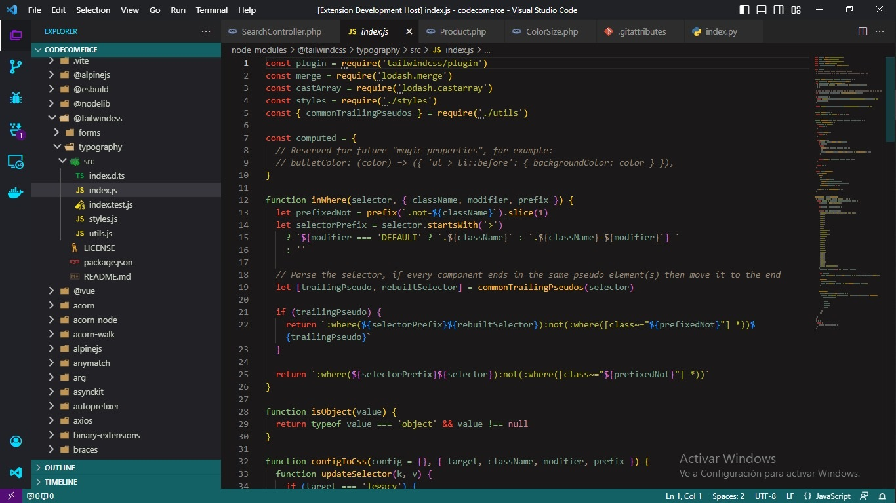
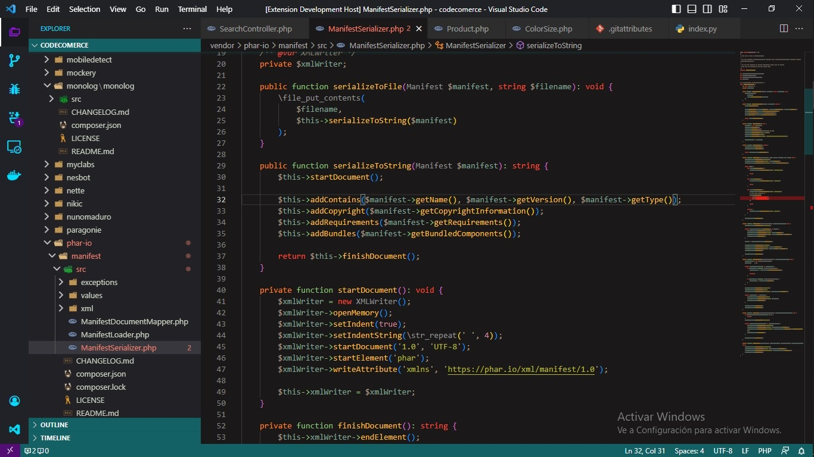

<h1 style="text-align:center">🌑 Dark Theme Neon 🌑</h1>

#### Installation
Launch VS Code, quick open `Ctrl+P`, paste the following command, and press enter.

#### Download
The extension is hosted on the <a href="https://marketplace.visualstudio.com/items?itemName=SebastianHT.fp">Visual Studio Code Marketplace.</a>

